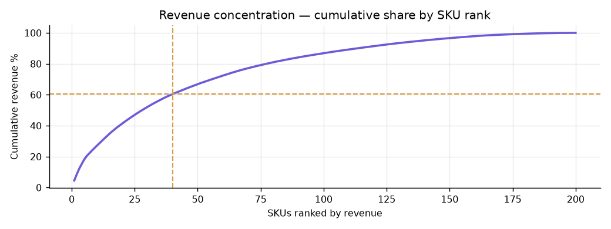
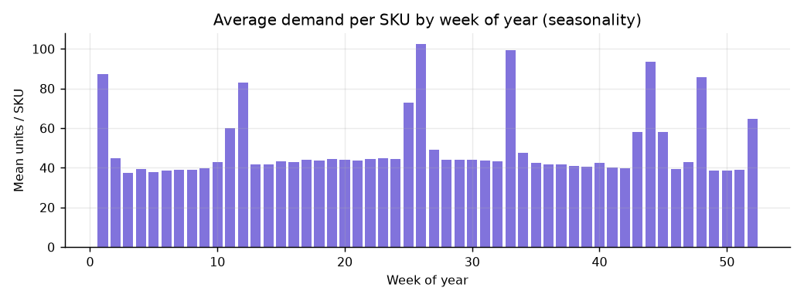
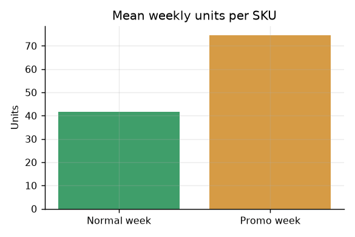
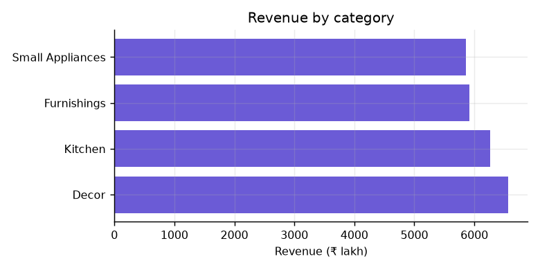

# Data Quality & EDA Insight Memo

**Project FORESIGHT — NorthBay Living**
**From:** Data Science, Zidio Development
**To:** Head of Operations, NorthBay Living
**Deliverable:** D2 — Data-quality & EDA insight memo

---

## Purpose

Before forecasting anything, we needed to answer two questions: can we trust the data you gave us, and what shape does your demand actually have? This memo answers both. Every number here is computed by `src/eda.py` and regenerated on each pipeline run, so nothing in it is hand-typed.

---

## Part 1 — Data quality

### What you gave us

| Extract | Grain | Rows received |
|---|---|---|
| `sales_daily` | One row per SKU per day | 146,700 |
| `sku_master` | One row per SKU | 200 |
| `calendar` | One row per date | 731 |
| `inventory_snapshots` | Periodic stock position per SKU | 5,200 |

After cleaning: **200 SKUs across 104 complete weeks** (Jan 2024 – Dec 2025), with no orphaned SKUs and no products missing a stock snapshot.

### What was broken, and what we did about it

| Issue | Scale | Handling | Why this choice |
|---|---|---|---|
| Exact duplicate sales rows | 500 rows | Dropped | Extract artefacts, not real transactions. Left in, they would inflate demand for affected SKU-days. |
| Negative unit quantities | 200 rows | Floored to zero | Almost certainly returns booked against the sale line. Demand cannot be negative. **Floored rather than deleted** — deleting the row would leave a gap that lag features silently read across. |
| Missing unit prices | 584 rows | Filled forward, then backward, within each SKU | Price is sticky over time, so a neighbouring week is a far better estimate than a global average. |
| Missing revenue values | 1,169 rows | Recomputed as units × price | Internally consistent and auditable, rather than imputed. |
| Missing unit cost | 8 SKUs | Imputed from category median | Keeps products in scope. **Flagged:** margin and capital-locked figures for these 8 SKUs are approximate. |
| Missing stock snapshots | 52 rows | Carried last known value forward | Stock is a level, not a flow — the last observation is the best estimate until a new one arrives. |
| Missing lead times | 26 rows | Filled within SKU, then global median | Lead time is a stable SKU attribute. |
| Inconsistent category labels | 40 SKUs | Normalised (trimmed, title-cased) | The same four categories appeared under several spellings from casing and stray whitespace. Left alone, this would have split each category into multiple fake categories and corrupted every category-level feature. |

### One decision worth calling out

**Weeks with no sales row are treated as zero demand, not missing demand.**

This sounds pedantic and is not. If a gap is left in place, the "previous week" feature silently reaches back two or three weeks instead of one — and it does so precisely for the SKUs that stopped selling, which are exactly the products we most need to get right. Filling these weeks with zero costs nothing and removes a whole class of quiet errors.

The full machine-readable audit log is at `reports/data_quality_report.json`, regenerated on every run.

### Data we would ask for next time

- **Discount depth**, not just a promotion flag. We can see *that* a promotion ran, not how aggressive it was, which caps how well promotional weeks can be forecast.
- **Daily or event-driven stock movements** rather than weekly snapshots. A SKU that moved sharply mid-week is currently scored against stale stock.
- **Stockout markers.** When a product was unavailable, recorded sales are zero — but true demand was not. Without a stockout flag, the model learns from suppressed demand and will under-forecast those SKUs.

---

## Part 2 — What the data shows

### Finding 1 — Your revenue is highly concentrated

**The top 20% of SKUs generate 60% of revenue.** The concentration is sharper still in risk terms: the top 10 products alone carry 64% of all the rupee value currently at stake.

*What this means for you:* planning effort should follow that curve rather than being spread evenly across 200 products. A weekly review of the top 40 SKUs would cover most of the money; the long tail can be managed by simple reorder rules.

### Finding 2 — Seasonality is strong, and therefore forecastable

**Peak weeks run 2.7× the quiet weeks** (peak at week 26, trough at week 3). Overall demand also grew about 8% between the first and second halves of the history.

*What this means for you:* a flat reorder rule is guaranteed to be wrong in both directions — over-ordering through the quiet season and under-ordering straight into the peak. It also means a forecast has real signal to work with, which is why the model beats a naive guess by 20%.

### Finding 3 — Promotions nearly double demand

Promotion weeks average **80% higher units per SKU** than normal weeks (74.6 vs 41.5 units).

*What this means for you:* any plan that ignores the promotion calendar will under-order ahead of every campaign you run — turning your own marketing into a stockout. Because you set the promo calendar yourself, this is information the forecast can legitimately use in advance, and it does.

### Finding 4 — Demand is lumpy at SKU level

4.5% of SKU-weeks have zero demand, and the median SKU has a coefficient of variation of 0.53, with 6% of SKUs above 1.0 (highly volatile).

*What this means for you:* single-number forecasts are misleading for the volatile tail, which is why every forecast ships with a confidence range. This finding also determined our accuracy metric — see below.

### Finding 5 — Category mix

**Decor is the largest category at 27% of revenue**, with the four categories otherwise fairly balanced. No category is small enough to ignore, and none dominates enough to plan around on its own.

---

## Part 3 — How this shaped the modelling

| Finding | Modelling consequence |
|---|---|
| Zero-demand weeks are common | **WAPE, not MAPE**, as the accuracy metric. MAPE divides by actual demand, so it is undefined or explosive on exactly those weeks. WAPE also weights by volume, matching how the business experiences error — being wrong about a best-seller costs more than being wrong about a slow mover. |
| Strong annual seasonality | A same-week-last-year anchor plus cyclical calendar features. This turned out to be the single most important fix in the whole model. |
| Promotions lift demand ~80% | Promotion flags included as features, using the forward calendar you already publish. |
| Revenue highly concentrated | Error reviewed weighted by revenue, and the dashboard prioritises by rupee value rather than by risk score. |
| Some SKUs have thin history | One pooled global model across all 200 SKUs, rather than 200 separate models. Pooling lets thin-history products borrow seasonal shape from their category. |

---

## Caveat

The extracts are a point-in-time snapshot. Every conclusion here holds for the period supplied (Jan 2024 – Dec 2025) and should be re-checked when the data is refreshed — `python run_all.py` regenerates this entire analysis, including the figures above.
